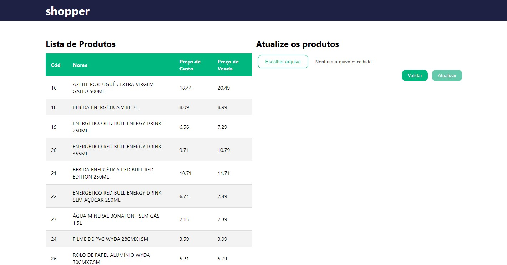

# Shopper - Teste Técnico
Teste técnico para vaga de Desenvolvedor Full Stack Júnior



# Tecnologias

- Linguagem Javascript
- React para o front-end
- Back-end com Node/Express.js
- Banco de dados com MySQL

# Requisitos

- [x] Ler arquivo csv
- [x] Botão validar para validação do reajuste: 
	- [x] Ao validar exibir as informações dos produtos: Codigo, Nome. Preço Atual, Novo preço
		- [x] Ao lado exibir as regras que foram quebradas se houver:
			- [x] Todos os campos necessários existem?
			- [x] Os códigos informados existem?
			- [x] Os preços estão preenchidos e são válidos?
			- [x] Preço de venda não pode ser menor que o preço de custo
			- [x] Impedir reajuste maior ou menor do que 10% do preço atual
			- [ ] Ao reajustar o preço de um pacote o arquivo deve possuir o reajuste dos componentes sendo sua soma igual ao preço do pacote
- [x] Botão atualizar: ficará habilitado se todos os produtos estiverem validados e sem regras quebradas
	- [x] Ao clicar no botão atualizar, salvar novo preço no banco de dados

# Guia de instalação

Primeiramente clone este projeto

Use o arquivo `database.sql` na raiz do projeto para criar o banco de dados MySQL

Para iniciar o back-end, abra um terminal e escreva:
```bash
cd server
npm install
```

Na pasta server crie um arquivo `.env` e preencha da seguinte forma:
```
HOST = 'localhost'
USER = 'root'
PASSWORD = 'root'
DATABASE = 'shopper_teste'
```

Substitua os valores entre aspas pelos configurados na sua máquina e rode o seguinte comando no terminal:
```bash
npm start
```

Para iniciar o front-end, em outra aba do terminal escreva: 
```bash
cd client
npm install
npm run dev
```

Use o arquivo `atualizacao_preco_exemplo.csv` na raiz do projeto como base para testar as validações